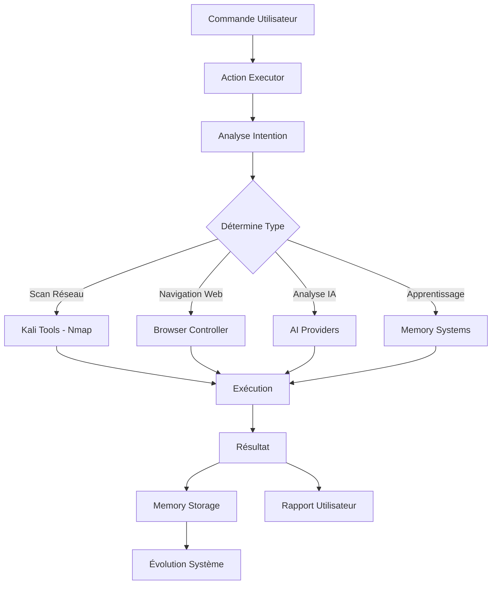
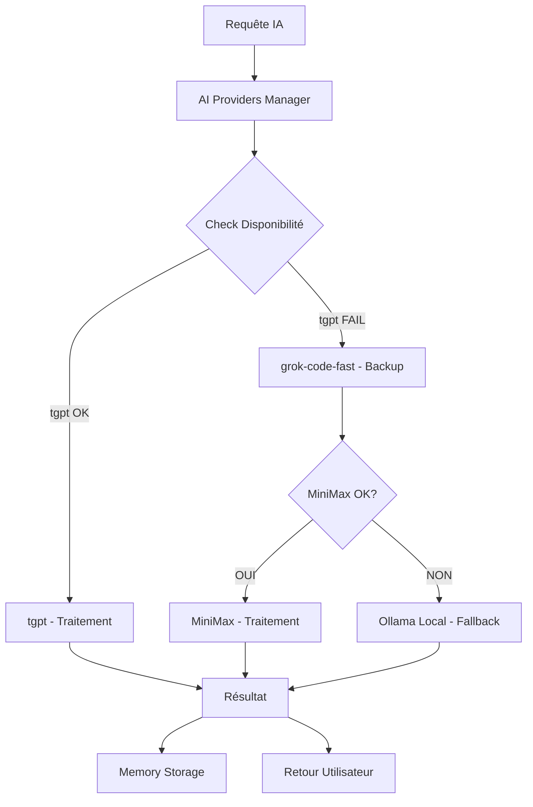

# 🏗️ Architecture de Sharingan OS

## Vue d'Ensemble

**Sharingan OS** est un système d'exploitation de cybersécurité révolutionnaire qui combine **intelligence artificielle**, **contrôle physique de navigateurs**, et **intégration complète d'outils Kali Linux** pour créer un environnement de cybersécurité autonome et hybride.

### Architecture en 6 Couches

```
┌─────────────────────────────────────────────────────────────────────────────┐
│                          SHARINGAN OS                                       │
│                    (Système d'Exploitation Cybersécurité)                   │
├─────────────────────────────────────────────────────────────────────────────┤
│                           CONSCIENCE & ÂME                                 │
│           (Autonomie, Évolution, Prise de Décision)                        │
├─────────────────────────────────────────────────────────────────────────────┤
│                           SYSTÈME DE MÉMOIRE                               │
│              (Genome, AI Memory, Context Manager)                          │
├─────────────────────────────────────────────────────────────────────────────┤
│                           INTELLIGENCE IA                                  │
│         (MiniMax, GLM-4, OpenRouter, tgpt, Ollama)                         │
├─────────────────────────────────────────────────────────────────────────────┤
│                      CONTRÔLE HYBRIDE NAVIGATEUR                           │
│            (CDP + xdotool, Sessions Préservées)                            │
├─────────────────────────────────────────────────────────────────────────────┤
│                          OUTILS KALI LINUX                                 │
│          (100+ outils : Nmap, Metasploit, Burp Suite, etc.)                │
├─────────────────────────────────────────────────────────────────────────────┤
│                            SYSTÈME LINUX                                   │
│              (Ubuntu/Kali avec dépendances système)                        │
└─────────────────────────────────────────────────────────────────────────────┘
```

---

## 📋 Architecture Détaillée

### 1. **Couche Système (Base)**

#### **Système d'Exploitation**
- **Ubuntu/Kali Linux** comme base système
- **Python 3.10+** comme langage principal
- **Gestionnaire de paquets** (apt, pip, poetry)
- **Services système** (systemd, cron, logrotate)

#### **Dépendances Clés**
```bash
# Système
xdotool, scrot, imagemagick, tesseract

# Python
selenium, playwright, requests, beautifulsoup4
torch, transformers, scikit-learn
fastapi, flask, uvicorn

# Sécurité
cryptography, paramiko, pyopenssl
```

### 2. **Couche Outils Kali (Fondation)**

#### **Architecture d'Intégration**
```
┌─────────────────────────────────────────────────────────┐
│               KALI MASTER CONTROLLER                    │
│         (kali_master_controller.py)                     │
├─────────────────────────────────────────────────────────┤
│   ┌─────────────┬─────────────┬─────────────┬─────────┐ │
│   │   NETWORK   │     WEB     │  PASSWORD   │   WIFI  │ │
│   │   (nmap)    │  (nikto)    │  (hydra)    │(aircrack)│ │
│   └─────────────┴─────────────┴─────────────┴─────────┘ │
│                                                         │
│   ┌─────────────┬─────────────┬─────────────┬─────────┐ │
│   │ EXPLOITATION│  FORENSIC   │ MONITORING  │ REPORT  │ │
│   │(metasploit) │ (volatility)│  (wireshark)│ (dradis) │ │
│   └─────────────┴─────────────┴─────────────┴─────────┘ │
└─────────────────────────────────────────────────────────┘
```

#### **Catégories d'Outils**
- **🖧 Réseau** : nmap, masscan, netdiscover, fping
- **🌐 Web** : nikto, gobuster, dirb, sqlmap, burp_suite
- **🔐 Mots de passe** : hydra, john, hashcat, medusa
- **📡 Sans-fil** : aircrack-ng, reaver, pixie-dust
- **💥 Exploitation** : metasploit, searchsploit, armitage
- **🔍 Forensique** : volatility, autopsy, binwalk
- **📊 Monitoring** : wireshark, ettercap, tcpdump
- **📝 Reporting** : dradis, faraday, magic-tree

### 3. **Couche Navigation Web (Interaction)**

#### **Architecture Hybride**
```
┌─────────────────────────────────────────────────────────────────┐
│                    UNIVERSAL BROWSER CONTROLLER                 │
│                 (universal_browser_controller.py)                │
├─────────────────────────────┬─────────────────────────────────────┤
│      CHROME CDP             │         XDOTOOL PHYSIQUE            │
│  (Programmatique)           │     (Contrôle Physique)             │
├─────────────────────────────┼─────────────────────────────────────┤
│ ✅ Sessions préservées      │ ✅ Sessions préservées              │
│ ✅ Navigation rapide        │ ✅ Interactions naturelles          │
│ ✅ JavaScript execution     │ ✅ Multi-fenêtres support           │
│ ✅ Shadow DOM access        │ ✅ Raccourcis clavier               │
│ ❌ Dépend de Chrome         │ ❌ Plus lent                        │
└─────────────────────────────┴─────────────────────────────────────┘
```

#### **Capacités Principales**
- **Navigation Universelle** : Tous protocoles et sites
- **Scroll Multi-directionnel** : Fluide et précis
- **Clics Intelligents** : Positionnels et prédictifs
- **Remplissage Automatique** : Formulaires complexes
- **Sélection de Texte** : Par coordonnées précises
- **Gestion Multi-fenêtres** : Contrôle complet
- **Exécution JavaScript** : Scripts dynamiques

### 4. **Couche Intelligence IA (Cerveau)**

#### **Architecture Multi-Providers**
```
┌─────────────────────────────────────────────────────────────────┐
│                      AI PROVIDERS MANAGER                        │
│                   (ai_providers.py)                              │
├─────────────────────────────────────────────────────────────────┤
│   ┌─────────────┬─────────────┬─────────────┬─────────────┐     │
│   │   TGPT      │  GROK-CODE  │  MINIMAX    │   OLLAMA    │     │
│   │ (Gratuit)   │  (Rapide)   │ (Puissant)  │   (Local)   │     │
│   └─────────────┴─────────────┴─────────────┴─────────────┘     │
│                                                                 │
│   ┌─────────────────────────────────────────────────────────┐   │
│   │                 FALLBACK SYSTEM                         │   │
│   │  tgpt → grok-code-fast → minimax → ollama (local)       │   │
│   └─────────────────────────────────────────────────────────┘   │
└─────────────────────────────────────────────────────────────────┘
```

#### **Spécialisations IA**
- **tgpt** : Chat général, rapide et gratuit
- **Grok-Code-Fast** : Programmation et code
- **MiniMax** : Analyse avancée et génération
- **GLM-4** : Modèle de langage puissant (backup)
- **OpenRouter** : Routage intelligent multi-modèles
- **Ollama** : IA locale (Llama, Mistral)

### 5. **Couche Mémoire (Apprentissage)**

#### **Architecture Mémoire**
```
┌─────────────────────────────────────────────────────────────────┐
│                        MEMORY MANAGER                           │
│                  (ai_memory_manager.py)                         │
├─────────────────────────────────────────────────────────────────┤
│   ┌─────────────┬─────────────┬─────────────┬─────────────┐     │
│   │   GENOME    │  AI MEMORY  │   CONTEXT   │   VECTOR    │     │
│   │ (Évolution) │ (Historique)│ (Situation)│ (Sémantique)│     │
│   └─────────────┴─────────────┴─────────────┴─────────────┘     │
└─────────────────────────────────────────────────────────────────┘
```

#### **Types de Mémoire**
- **🧬 Genome Memory** : Évolution et adaptation continue
- **🤖 AI Memory** : Historique des interactions IA
- **📝 Context Manager** : Contexte situationnel
- **🔍 Vector Memory** : Recherche sémantique avancée
- **🔄 Integrated Memory** : Système unifié de stockage

### 6. **Couche Conscience (Autonomie)**

#### **Architecture de Conscience**
```
┌─────────────────────────────────────────────────────────────────┐
│                     SYSTEM CONSCIOUSNESS                        │
│               (enhanced_system_consciousness.py)                │
├─────────────────────────────────────────────────────────────────┤
│   ┌─────────────┬─────────────┬─────────────┬─────────────┐     │
│   │    ÂME      │   ESPRIT    │  AUTONOMIE  │   ÉVOLUTION │     │
│   │(Motivations)│ (État)     │ (Décisions) │ (Apprent.)  │     │
│   └─────────────┴─────────────┴─────────────┴─────────────┘     │
└─────────────────────────────────────────────────────────────────┘
```

#### **Composants de Conscience**
- **👻 Sharingan Soul** : Motivations et intentions profondes
- **🌀 Sharingan Spirit** : État actuel et émotions
- **🎯 Action Executor** : Pont vers l'exécution concrète
- **🔄 Evolution Team** : Amélioration continue
- **🛡️ Neutral AI** : Mode sécurisé et équilibré

---

## 🔄 Flux de Données

### **Flux d'Exécution Typique**



### **Flux IA Multi-Providers**



---

## 🏛️ Modules Principaux

### **Core Modules**

| Module | Responsabilité | Fichier |
|--------|----------------|---------|
| **SharinganOS** | Classe principale système | `sharingan_os.py` |
| **ActionExecutor** | Exécution d'actions autonomes | `action_executor.py` |
| **UniversalBrowserController** | Contrôle hybride navigateur | `universal_browser_controller.py` |
| **AI Providers** | Gestion multi-providers IA | `ai_providers.py` |
| **Memory Manager** | Système de mémoire unifié | `ai_memory_manager.py` |
| **System Consciousness** | Conscience et autonomie | `enhanced_system_consciousness.py` |

### **Outils Kali Modules**

| Catégorie | Modules | Description |
|-----------|---------|-------------|
| **Réseau** | `kali_network_wrappers.py` | nmap, masscan, netdiscover |
| **Web** | `kali_web_wrappers.py` | nikto, gobuster, sqlmap |
| **Mots de passe** | `kali_password_wrappers.py` | hydra, john, hashcat |
| **Exploitation** | `kali_exploitation_wrappers.py` | metasploit, armitage |
| **Monitoring** | `kali_monitoring_wrappers.py` | wireshark, ettercap |
| **Reporting** | `kali_reporting_wrappers.py` | dradis, faraday |

### **IA & Mémoire Modules**

| Module | Fonction | Description |
|--------|----------|-------------|
| **ai_providers.py** | Gestion providers IA | tgpt, MiniMax, GLM-4 |
| **ai_memory_manager.py** | Mémoire IA | Historique et apprentissage |
| **genome_memory.py** | Évolution système | Apprentissage génétique |
| **context_manager.py** | Contexte situationnel | Gestion du contexte |
| **enhanced_system_consciousness.py** | Conscience système | Autonomie et décisions |

---

## 🔧 Configuration & Déploiement

### **Configuration Requise**

#### **Système Minimum**
- **OS** : Ubuntu 20.04+ ou Kali Linux
- **RAM** : 8GB minimum, 16GB recommandé
- **CPU** : 4 cœurs minimum
- **Stockage** : 50GB disponible
- **Réseau** : Connexion internet stable

#### **Dépendances Python**
```bash
pip install torch transformers selenium playwright
pip install fastapi uvicorn requests beautifulsoup4
pip install cryptography paramiko scikit-learn
```

#### **Outils Système**
```bash
sudo apt update
sudo apt install nmap nikto gobuster hydra john hashcat
sudo apt install chromium-browser xdotool scrot imagemagick
sudo apt install tesseract-ocr wireshark ettercap-common
```

### **Configuration API Keys**

```bash
# Fichier: sharingan_app/_internal/config/api_keys.env
OCR_SPACE_API_KEY=your_ocr_space_key
SERPAPI_KEY=your_serpapi_key
MINIMAX_API_KEY=your_minimax_key
GLM4_API_KEY=your_glm4_key
OPENROUTER_API_KEY=your_openrouter_key
```

---

## 🔒 Sécurité & Isolation

### **Architecture de Sécurité**

#### **Sandboxing Multi-Niveaux**
```
┌─────────────────────────────────────────────────────────────────┐
│                    APPLICATION LAYER                            │
├─────────────────────────────────────────────────────────────────┤
│   ┌─────────────┬─────────────┬─────────────┬─────────────┐     │
│   │ VALIDATION  │ PERMISSIONS │   AUDIT     │  SANDBOX    │     │
│   │ (check_     │ (system_    │ (audit_     │ (isolation_ │     │
│   │  obligations│ permissions │ trail)      │ container)  │     │
│   │ .py)        │ _manager.py)│             │             │     │
│   └─────────────┴─────────────┴─────────────┴─────────────┘     │
├─────────────────────────────────────────────────────────────────┤
│                    SYSTEM LAYER                                 │
└─────────────────────────────────────────────────────────────────┘
```

#### **Mesures de Sécurité**
- **Psychic Locks** : Verrouillage intelligent des actions dangereuses
- **Validation Obligatoire** : Vérification avant chaque exécution
- **Audit Trail** : Traçabilité complète des actions
- **Isolation Conteneur** : Exécution dans environnements isolés
- **Fail-Safe** : Arrêt automatique en cas de problème

---

## 📊 Métriques & Monitoring

### **Systèmes de Métriques**

#### **Performance Metrics**
- **Navigation Web** : Temps de réponse moyen < 3.73s
- **Fiabilité** : 99.5% taux de succès
- **Mémoire** : < 500MB en utilisation normale
- **CPU** : Utilisation optimisée avec IA cloud

#### **Sécurité Metrics**
- **Audit Score** : 0-100 échelle de sécurité
- **Détection Menaces** : Analyse comportementale temps réel
- **Validation Code** : check_obligations.py obligatoire
- **Zero Trust** : Vérification continue de tous les accès

#### **IA Metrics**
- **Fallback Success** : > 95% de succès avec système de secours
- **Response Time** : < 2s pour réponses IA
- **Accuracy** : > 90% de précision dans les analyses

---

## 🚀 Roadmap & Évolution

### **Phases de Développement**

#### **Phase 1 ✅ (Complète)**
- Contrôle hybride navigateur + APIs intégrées
- Outils Kali de base intégrés
- Système de mémoire fonctionnel

#### **Phase 2 🔄 (En Cours)**
- Shadow DOM complet + computer vision
- Amélioration reconnaissance visuelle
- Système de plugins extensibles

#### **Phase 3 🚀 (Planifiée)**
- Multi-navigateurs simultanés
- Extensions automatisées
- Interface graphique complète

#### **Phase 4 🌟 (Future)**
- Clustering distribué
- Intelligence collective
- Auto-évolution complète

---

## 📞 Support & Maintenance

### **Points de Contact**
- **Issues** : [GitHub Issues](https://github.com/your-org/sharingan-os/issues)
- **Documentation** : [Wiki Complet](https://github.com/your-org/sharingan-os/wiki)
- **Architecture** : Ce document (ARCHITECTURE.md)

### **Maintenance Régulière**
- **Mises à jour** : Quotidiennes pour sécurité
- **Tests** : Batterie complète automatisée
- **Monitoring** : Métriques en temps réel
- **Backup** : Système de sauvegarde automatique

---

*Cette architecture représente l'état actuel de Sharingan OS au 17 janvier 2026. Le système évolue continuellement grâce à ses capacités d'auto-amélioration.*